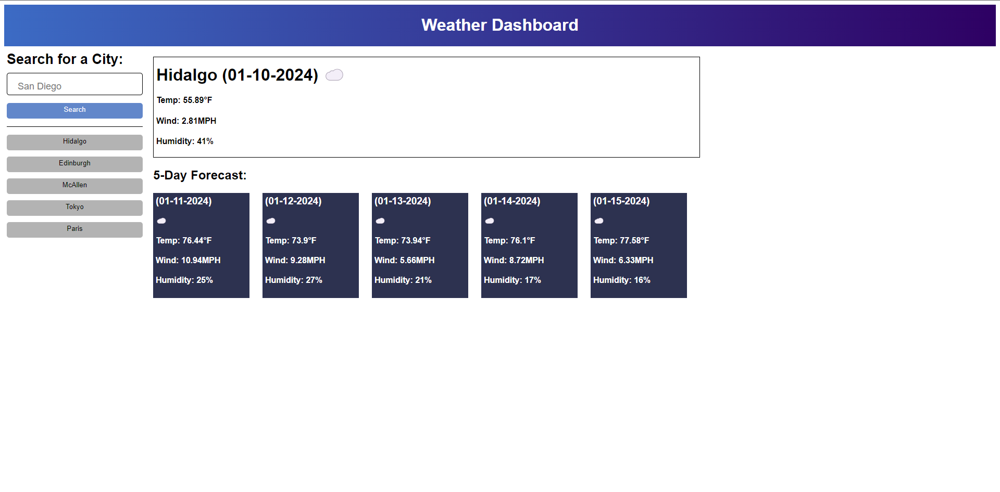

# Weather-API
6th Challenge

Deployed: [here](https://dannysanchez03.github.io/Weather-API/)

## Description

In this 6th Challenge I was told to create a Weather API using a Server Side API, https://openweathermap.org/api, my key will expire which means the website will not be able to make any more fetch calls to the server API. I had so much fun actutally figuring how to get this whole website to work, I also had a blast doing the css for it, the html was rather quick and easy to set it up with the css, other than that it was really awesome understanding the object structure that this API returned back to me in JSON format.

## Installation

## Usage

N/A

## Credits

N/A

## License

MIT License

Copyright (c) 2023 DannySanchez03

Permission is hereby granted, free of charge, to any person obtaining a copy
of this software and associated documentation files (the "Software"), to deal
in the Software without restriction, including without limitation the rights
to use, copy, modify, merge, publish, distribute, sublicense, and/or sell
copies of the Software, and to permit persons to whom the Software is
furnished to do so, subject to the following conditions:

The above copyright notice and this permission notice shall be included in all
copies or substantial portions of the Software.

THE SOFTWARE IS PROVIDED "AS IS", WITHOUT WARRANTY OF ANY KIND, EXPRESS OR
IMPLIED, INCLUDING BUT NOT LIMITED TO THE WARRANTIES OF MERCHANTABILITY,
FITNESS FOR A PARTICULAR PURPOSE AND NONINFRINGEMENT. IN NO EVENT SHALL THE
AUTHORS OR COPYRIGHT HOLDERS BE LIABLE FOR ANY CLAIM, DAMAGES OR OTHER
LIABILITY, WHETHER IN AN ACTION OF CONTRACT, TORT OR OTHERWISE, ARISING FROM,
OUT OF OR IN CONNECTION WITH THE SOFTWARE OR THE USE OR OTHER DEALINGS IN THE
SOFTWARE.
